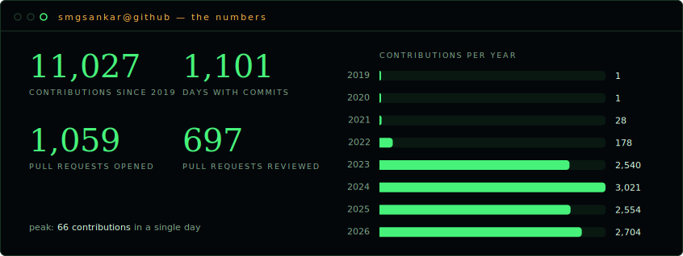
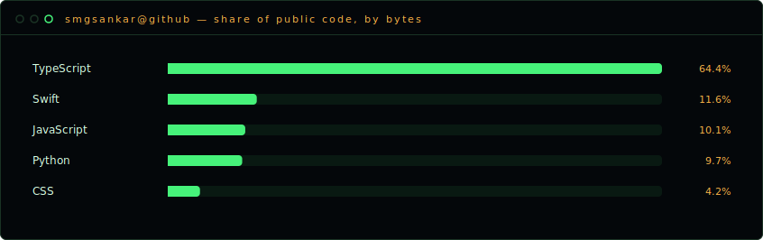

<div align="center">

# Gomathi Sankar

**Frontend Engineer · Bangalore, India**

Shipping TypeScript for a living, side-questing in Swift & Python for fun.

[](https://github.com/smgsankar)
[](mailto:gomzsankar@gmail.com)

</div>

---

## 🌃 The skyline

This repo is also my portfolio — **8 years of my GitHub contribution graph, raised into a 3D skyline you can fly across**, built with three.js. Every bar is a real day of commits, pulled from the GitHub GraphQL API.

```
2019 ▏1
2020 ▏1
2021 ▎28
2022 █ 178
2023 ████████████████████ 2,540
2024 ████████████████████████ 3,021
2025 ████████████████████ 2,554
2026 █████████████████████ 2,698 (and counting)
```

> **11,021 contributions** · **1,100 active days** · **1,059 PRs opened** · **697 PRs reviewed** · peak of **66 contributions in a single day**

Run it locally:

```bash
npm install
npm run dev   # → http://localhost:3000
```

## 🧰 Toolkit

`TypeScript` is home — roughly two-thirds of everything I've pushed publicly. The rest:

| | | |
|---|---|---|
| **Daily drivers** | TypeScript · JavaScript · React | the day job |
| **Native curiosity** | Swift | a macOS clipboard manager, from scratch |
| **Backend forays** | Python · Node.js | APIs behind the frontends |
| **Craft** | CSS · module federation · TDD | the sharpening stones |

## 🛠 Selected builds

- **[beyond-boundary](https://github.com/smgsankar/beyond-boundary)** — fantasy cricket platform: build custom squads and compete with cricket fanatics worldwide
- **[fifa-wc-2026](https://github.com/smgsankar/fifa-wc-2026)** — World Cup 2026 companion, TypeScript front + Python back
- **[clipboard-manager-macos](https://github.com/smgsankar/clipboard-manager-macos)** — native macOS clipboard manager in Swift
- **[website-design-match-evaluator](https://github.com/smgsankar/website-design-match-evaluator)** — scores a built website against its design reference image
- **[json-array-table-editor](https://github.com/smgsankar/json-array-table-editor)** — VS Code extension: edit JSON arrays as tables
- **[frontend-mentor-challenges](https://github.com/smgsankar/frontend-mentor-challenges)** — monorepo of UI challenges, the practice ground

## 📈 Stats

<div align="center">





<sub>Rendered from live GitHub API data by <a href="scripts/refresh-data.mjs">a script in this repo</a>, refreshed weekly — no third-party image services to break. The same job re-bakes the 3D skyline's data and redeploys the portfolio.</sub>

</div>

---

<div align="center">
<sub>The skyline keeps growing. Want to build something on it together? → <a href="mailto:gomzsankar@gmail.com">gomzsankar@gmail.com</a></sub>
</div>
